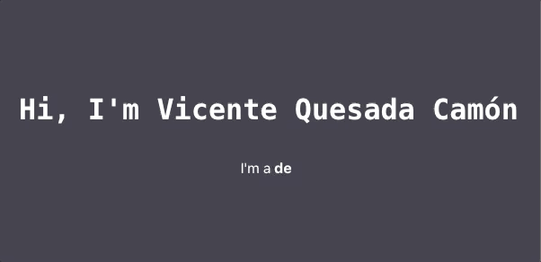
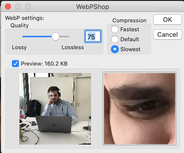

# Portfolio

In this project I'm going to build my own portfolio. I'm going to implement the best practices I've learn during my coding experience years.
Also I will try to explain the steps I'm taking to build it as easy and precise as I can.

First of all, I'm going to build it on ReactJS, a Framework based on JavaScript and HTML. We can create a blank project using create-react-app. Here is a little bit of information about this topic : https://en.reactjs.org/docs/create-a-new-react-app.html

Steps taken:

- npx create-react-app portfolio

Now we can access and work on our blank project.

First of all, when we inicializate the project (yarn && yarn start) we can see the App.js file with the React logo spinning and a link to the reactjs.org site. That's fine to get started learning how React works and some basics (and advanced) resources to build ReactJS applications.
We are going to get rid of it, since we know what we want to do, a great, nice looking, proffesional and stylish portfolio.

We are going to get rid of the React logo and the link so we can have a blanck App.js file to modify. I will leave the styles by default at the beginning, because we are structuring our project first.

So, we can type whatever we want to add to our portfolio, this is complete personal. Some time ago I discovered an animation for ReactJs which I love. It's called react-typical. You can find it here: https://www.npmjs.com/package/react-typical

We can see the result in the gif below:



This layout is responsive, so the size of the text will be addapted automaticaly to the browser window dimensions.

Now we are going to add a picture so people can see who we are.
As we want to create a proffesional portfolio, we are going to optimize the images we add so it can load fast.
To do so, we are going to use Adobe Photoshop and ImageMagick.
I suppose everyone reading this knows what Adobe Photoshop is, but I'm not quite sure about that speaking of ImageMagick. This is a tool that allows us to modify images (change format, resize, etc ...) directly from the terminal
You can find info about it here: https://imagemagick.org/index.php

Folliwing the indications of Lighthouse audit, we must serve the images with a good size and a next-gen format. This makes the loading time quite much fast.
You can find more information on this links: https://web.dev/uses-responsive-images/?utm_source=lighthouse&utm_medium=devtools
https://web.dev/serve-responsive-images/

So, we install ImageMagick and Photoshop. We are going to resize the image so that the browser can render the most appropriate size for the resolution it is in. Also we are going to add the WebP format to the images, so we can have a next-gen format also. Personally I prefer to use Photoshop with the WebP Plug-in, because in my opinion is much more usser friendly (at least for me) and you can see the preview of the result.

In order to get the WebP Plug-in, you can check this out: https://developers.google.com/speed/webp/docs/webpshop

First of all, we are going to convert the picture from the original format (jpg for me) to WebP.
We can do it easily with Photoshop, just saving the image as WebP (this only works after adding the Plug-in). Before finishing the saving process, a prompt window will appear, allowing you to choose the quality of the picture. In my case I will chose Quality: 75, Compression: Slowest.



NOTE: you can also do this with ImageMagick, using the following command:

    magick imageName.jpg -quality 75 -define webp:loseless=true imageName.webp

Keep in mind that the bigger the image is, the slower result you will get. WebP is pretty good compressing images, so don't be scared if your picture size is below 1Mb! With a good resolution the picture will render fine.

Now that we have our image with the two formats, we are going to resize it.
For this task we are going to use ImageMagick.
The strategy here is to have 5 images, each one reducing its size by 20% compared to the original.

You can do this using the following commands:

    convert -resize 20% imageName.jpg imageName@1x.jpg
    convert -resize 40% imageName.jpg imageName@2x.jpg
    convert -resize 60% imageName.jpg imageName@3x.jpg
    convert -resize 80% imageName.jpg imageName@4x.jpg
    convert -resize 100% imageName.jpg imageName@5x.jpg

As you can see, we vary the percentaje of the resize, changing also the name of the file.
The goal here is to make the title explanatory, so that we can know at a glance what size the image is with respect to the smallest (in this case @1x). We can read this like: 5x = 1x * 5 or 100% = 20% * 5.

We have to do the same with the WebP images, just replacing the .jpg extension for .webp.

    convert -resize 20% imageName.webp imageName@1x.webp
    convert -resize 40% imageName.webp imageName@2x.webp
    convert -resize 60% imageName.webp imageName@3x.webp
    convert -resize 80% imageName.webp imageName@4x.webp
    convert -resize 100% imageName.webp imageName@5x.webp

To mantain an order into the project, I recomend to classify the different formats in separated folders.
Also, it's a good practice to have a folder called img or images where you place the images you use on the project, so it's recommendable to put the jpg and webp folders into it.

Once we have all the resize images, we have to import them to our APP.js

After that, we are going to use the ````<picture>```` tag from HTML to render the images, adding also the ````<source>```` and ```````` tags as showed below:

````

<picture>
  <source
  className="Image"
    srcset={`${personalImage1xwebp} 429w, ${personalImage2xwebp} 857w, ${personalImage3xwebp} 1286w, ${personalImage4xwebp} 1714w, ${personalImage5xwebp} 2143w`}
    type="image/webp"
  />
  
</picture>

````

Fixing some css styles we get to this final result:


Steps taken:

- Install react-typical on the project
- Install ImageMagick
- Install Photoshop & WebP Plug-in
- Format and resize images
- Customize App.js


Once we have our initial page, we are going to build the rest.

I've been researching and I've found an API which I guess is perfect for our pourpose. I would like to thank Trey Huffine
for his job, such a quality resource he build!
More info and details here: https://gitconnected.com/portfolio-api

Lets begin with the folder structure:

As we wanted to design the initial page with our picture, we used the App.js to preview the result in an easy way, but now we are going to add more components to the project, so the structure changes.

We create a folder inside src called components.

In components we are going to create a subfolder for each new component we want to add to our project.


## License

This project is licensed under the MIT License.